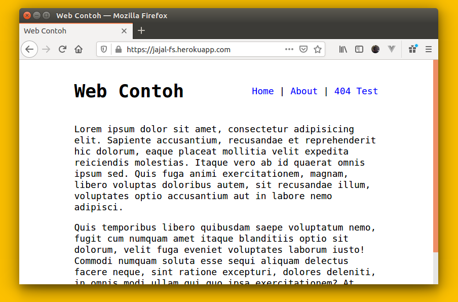

# Node FileSystem Stream



Program latihan membuat web server sederhana dengan menggunakan modul bawaan NodeJS.

Selama ini kita dimanjakan dengan banyaknya package siap pakai di NPM, pernahkah terpikir gimana sih sebetulnya cara kerja [ExpressJS](https://expressjs.com/)? Yaa meskipun ga secanggih do'i, setidaknya kita sama-sama belajar _basic_ cara kerjanya.

Di repo ini saya memanfaatkan module **http**, **fs**, dan **path**. Ketiga nya bawaan pabrik, jadi tidak ada proses `npm install`.. :p

<a href="https://jajal-fs.herokuapp.com" target="_blank">Link Demo</a>

## Instalasi

none

## Running

```bash
npm start

# atau

node server.js
```

Silahkan akses url nya `http://localhost:1234` via browser.

Semoga bermanfaat.
